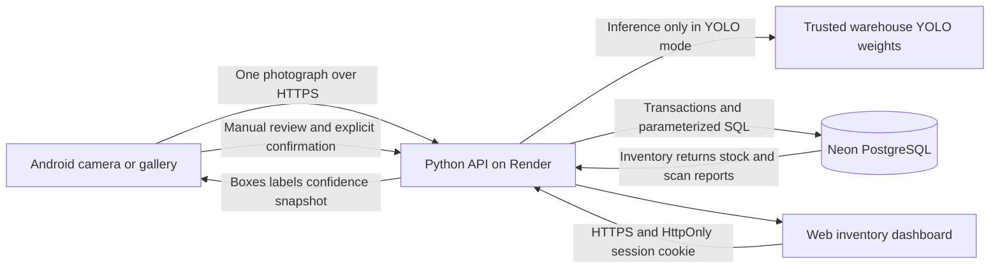
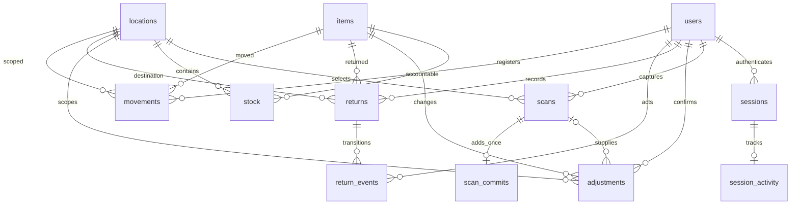

# Architecture and database design

MOVIS uses a client-server architecture. The Android app submits a still image
and verified actions over HTTPS. Render serves the website and Python WSGI API.
The API alone connects to Neon PostgreSQL; database credentials are never sent to
Android or browser JavaScript. SQLite is available only for isolated local work.

No camera surveillance, physical automation or background stock approval occurs.
The web refreshes every 15 seconds while visible. The browser uses an HttpOnly,
SameSite=Strict cookie; hosted deployments mark it Secure. Android uses an opaque
bearer session token. Both share account roles and expiry checks.

## Entity relationships

| Table | Primary key and important fields |
|---|---|
| users | id; unique username; password hash; constrained role |
| sessions | opaque token; user_id; absolute expiry |
| session_activity | token FK with cascade delete; last_seen |
| auth_attempts | bucket hash/name and attempt timestamp; indexed rolling limit, no password |
| items | id; unique SKU; name; unique model_class |
| locations | id; unique name |
| stock | composite item_id/location_id; nonnegative quantity; version |
| scans | UUID; user/location/mode; detections and stock snapshot JSON; timestamp |
| adjustments | id; unique request key; payload fingerprint; optional scan_id; item/location; previous/verified/difference/reason/user/time |
| scan_commits | request key; unique scan_id; fingerprint and original response |
| returns | id; unique request key; fingerprint; item/location/quantity/reason/status/user/time |
| return_events | id; return_id; previous/new status; user/time |
| movements | id; item/location/difference/balance/source/user/time; unique source type and source id |

movements.source_id is a polymorphic reference: adjustment IDs for stock changes
and return IDs for restocks. It is not a database FK to one table. auth_attempts
has no account FK because failed attempts may target unknown accounts. Scans store
results and snapshots, not original photos or measured physical ground truth.
The actual SQL schemas are backend/schema.sql and backend/schema-postgres.sql.

## Processing algorithms

Scan:
1. Authenticate and require administrator/operator access.
2. Validate location and decode the bounded uploaded image; normalize orientation.
3. Snapshot registered stock and map exact model class labels to catalog items.
4. In demo mode create declared sample detections; in YOLO mode call the trained
   model once under the inference lock. No inventory change happens here.
5. Store scan UUID, detections, mode, owner, location and snapshot; return results.

Incoming stock:
1. User corrects quantities and explicitly confirms these are new units.
2. Begin serialized transaction; match request key/fingerprint for safe retries.
3. Require scan ownership and reject a previously committed/reconciled scan.
4. For each registered item add the verified positive quantity to CURRENT stock,
   validate the resulting bound, increment version and record adjustment/movement.
5. Save one scan commit and the original response; commit atomically.

Complete count:
1. User physically counts the ENTIRE selected item/location, including unseen units.
2. Review previous quantity, verified total and difference; explicitly confirm.
3. Begin transaction; return original response for an identical retry key.
4. Check scan owner/location, reject incoming-use scan and repeated item commit.
5. Compare current stock version with the scan snapshot; reject stale counts.
6. difference = verified_total - previous_quantity. Set the stock total, increment
   version and save the complete adjustment record and movement; commit.

Returns:
1. Record positive quantity and reason with an idempotency key; no stock addition.
2. pending inspection -> accepted or damaged.
3. accepted -> returned to available stock or damaged.
4. Require explicit suitability confirmation before restocking. In one transaction
   validate balance, increment stock, record movement/event and set final status.
5. An identical final status retry does not restock again. Damaged and restocked
   records cannot transition into another stock addition.

SQLite uses BEGIN IMMEDIATE. PostgreSQL uses a transaction-scoped advisory write
lock to provide matching check/write behavior. Version checks protect reconciliation;
idempotency keys protect retries. This intentionally simple locking strategy trades
high write throughput for easier correctness in one selected warehouse.
